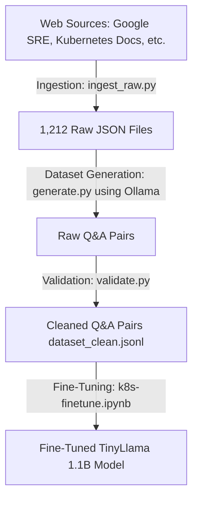

# Kubernetes Fine-Tuning Pipeline

This repository contains the pipeline for collecting Kubernetes and SRE documentation, generating question-answering (Q&A) datasets, validating the generated QA pairs, and fine-tuning a Small Language Model (SLM) on the processed dataset.

---

## Pipeline Overview



---

## 1. Data Ingestion & Curation Strategy

### Comparison: Instructor's Proposed Strategy vs. Implemented Strategy

The instructor proposed a manual chunking and curation strategy targeting official Kubernetes documentation. The **actually implemented strategy** scales much better, automates data cleaning, and covers a broader scope.

| Feature | Instructor's Proposal | Implemented Ingestion (This Repo) |
| :--- | :--- | :--- |
| **Scope** | Only official K8s Markdown docs | **5 authoritative sources**: Kubernetes Docs, Prometheus Runbooks, Kubernetes Failures, OpenSRE, and Google SRE |
| **Scale** | ~200 chunks, manually cleaned to 100–150 | **1,212 complete documents** ingested automatically |
| **Curation** | Manual clustering and de-duplication | Programmatic validation and deduplication in [`validate.py`](file:///d:/rag-assistant/k8s-finetune/services/dataset/validate.py) |
| **Tagging/Chunking** | Manual URL/version tracking & failure class tagging | Automated tracking via source mapping, md5-hash generation, and automated validation |

#### Why the Implemented Strategy is Better
1. **Broader SRE Knowledge**: By ingesting Prometheus Runbooks, SRE books, and failure stories alongside official docs, the SLM gains actual troubleshooting knowledge rather than just API definitions.
2. **Scalability**: Manual curation of 100 documents does not scale. Automated scraping and programmatically-validated Q&A pair extraction allows scaling to thousands of high-quality samples.
3. **Data Integrity**: Automated hashing prevents duplicate processing, and programmatic filtering removes bad formatting or hallucinated model text without human error or bias.

---

## 2. Ingestion Code Implementation

The raw documentation is collected using scraping/fetching scripts and standardized into single JSON files containing page metadata and content.

* **Target Script**: [ingest_raw.py](file:///d:/rag-assistant/k8s-finetune/services/ingestion/ingest_raw.py)
* **Output**: `1,212` raw JSON documents stored in the `data/raw/` folder.

### Key Code Logic

1. **[save_document](file:///d:/rag-assistant/k8s-finetune/services/ingestion/ingest_raw.py#L17)**: Standardizes and serializes each scraped document. An MD5 hash is generated from the source URL to act as a unique file identifier (`doc_id`).
   ```python
   def save_document(doc: dict, source_name: str):
       os.makedirs(OUTPUT_DIR, exist_ok=True)
       doc_id = hashlib.md5(doc["metadata"]["source_url"].encode()).hexdigest()
       filename = f"{source_name}_{doc_id}.json"
       filepath = os.path.join(OUTPUT_DIR, filename)
       with open(filepath, "w", encoding="utf-8") as f:
           json.dump({
               "id": doc_id,
               "source": source_name,
               "title": doc["metadata"]["title"],
               "source_url": doc["metadata"]["source_url"],
               "text": doc["text"]
           }, f, indent=2, ensure_ascii=False)
   ```

2. **[run](file:///d:/rag-assistant/k8s-finetune/services/ingestion/ingest_raw.py#L35)**: Iterates over the specified generators (e.g., Google SRE books, Kubernetes docs) and triggers `save_document` for each yielded page.

---

## 3. Dataset Generation (Ollama / Local LLM Style)

For generating the training Q&A dataset, the pipeline runs local inference or structured API calls formatted for Ollama style local completion. 

### Generation Strategy & Negating Limits
* **Original Run**: An initial dataset was generated using a local Ollama model producing 3 QA pairs per document, yielding **2,600 validated Q&A pairs**.
* **Current Run / Multi-Model Strategy**: To negate rate limits and context restrictions, multiple Ollama models are distributed across generation passes:
  * `llama-3.1-8b-instant`
  - `meta-llama/llama-4-scout`
  - `allam-2-7b`
  - `qwen/qwen3-32b`

* **Target Script**: [generate.py](file:///d:/rag-assistant/k8s-finetune/services/dataset/generate.py)

### Key Code Logic

1. **Structured Prompts**: A strict system prompt ensures the models output valid JSON without conversational wrapper text (preamble or markdown fences).
   ```python
   SYSTEM_PROMPT = (
       "You are a Kubernetes expert creating a training dataset. "
       "You always respond with valid JSON only — no preamble, no markdown "
       "code fences, no commentary."
   )
   ```

2. **[generate_pairs](file:///d:/rag-assistant/k8s-finetune/services/dataset/generate.py#L161)**: Truncates documents to fit local model context limits (trimmed to 2,500 characters) and constructs the prompt asking for structured Q&A JSON formatting.
   ```python
   def generate_pairs(doc: dict) -> list[dict]:
       text = doc["text"][:2500]
       prompt = GENERATION_PROMPT.format(
           title=doc["title"],
           source=doc["source"],
           text=text
       )
       # Calls Ollama endpoint / API client returning choices
       ...
   ```

---

## 4. Dataset Validation & Cleaning

To ensure the high quality of the instruction-tuning pairs, raw output pairs are passed through a strict validator to remove duplicates, bad formatting, and low-quality model behavior.

* **Target Script**: [validate.py](file:///d:/rag-assistant/k8s-finetune/services/dataset/validate.py)
* **Output**: `dataset_clean.jsonl` containing high-quality pairs.

### Key Code Logic

1. **Rejection Rules & [is_valid](file:///d:/rag-assistant/k8s-finetune/services/dataset/validate.py#L67)**: Checks each Q&A pair against criteria:
   - **Hedging Check**: Filters phrases indicating guessing (e.g. *"not explicitly stated"*, *"could imply"*).
   - **Self-Reference Check**: Rejects boilerplate AI self-mentions (e.g. *"as an AI language model"*).
   - **Admitted Ignorance Check**: Rejects fallback responses (e.g. *"I don't know"*).
   - **Truncation Check ([looks_truncated](file:///d:/rag-assistant/k8s-finetune/services/dataset/validate.py#L48))**: Uses regular expressions and trailing word check to see if responses end abruptly without ending punctuation.
   - **Length Constraints**: Minimum of 10 chars for instructions, 20 chars for responses.

2. **Deduplication ([run](file:///d:/rag-assistant/k8s-finetune/services/dataset/validate.py#L108))**: Dedups instruction-response pairs so that identical questions and answers are not repeated in the training split.
   ```python
   key = (
       str(pair.get("instruction", "")).strip().lower(),
       str(pair.get("response", "")).strip().lower(),
   )
   if key in seen:
       duplicates += 1
       continue
   seen.add(key)
   valid.append(pair)
   ```

---

## 5. Model Fine-Tuning

The clean dataset is used to fine-tune a TinyLlama (1.1B) model using Parameter-Efficient Fine-Tuning (PEFT) and QLoRA.

* **Target Notebook**: [k8s-finetune.ipynb](file:///d:/rag-assistant/k8s-finetune/notebooks/k8s-finetune.ipynb)
* **Dataset Split**: A **95% Train / 5% Test** split is implemented (`train_size=2489`, `test_size=131`) using a fixed seed (`42`). This split ratio is chosen over traditional 80/20 splits to maximize the available training examples for learning specific Kubernetes SRE diagnostics.
* **Hyperparameters**: 7 Epochs, Batch Size of 4, Gradient Accumulation Steps of 4, Learning Rate of `2e-4`.

### Important Code Segments

1. **4-Bit Quantization Setup**:
   Loads the model using a 4-bit NormalFloat (`nf4`) quantization format to drastically reduce GPU memory footprint on the accelerator.
   ```python
   bnb_config = BitsAndBytesConfig(
       load_in_4bit=True,
       bnb_4bit_quant_type="nf4",
       bnb_4bit_compute_dtype=torch.float16,
       bnb_4bit_use_double_quant=True,
   )

   model = AutoModelForCausalLM.from_pretrained(
       MODEL_NAME,
       quantization_config=bnb_config,
       device_map="cuda:0",
   )
   model = prepare_model_for_kbit_training(model)
   ```

2. **PEFT/LoRA Configuration**:
   Sets up low-rank adapters targetting the attention projection matrices (`q_proj`, `v_proj`, `k_proj`, `o_proj`) with rank `r=16`.
   ```python
   lora_config = LoraConfig(
       r=16,
       lora_alpha=32,
       target_modules=["q_proj", "v_proj", "k_proj", "o_proj"],
       lora_dropout=0.05,
       bias="none",
       task_type="CAUSAL_LM",
   )
   model = get_peft_model(model, lora_config)
   ```

3. **Supervised Fine-Tuning Configuration (SFTConfig)**:
   Specifies the training hyperparameters such as 7 epochs, learning rate of `2e-4`, BF16 mixed-precision, and gradient checkpointing.
   ```python
   training_args = SFTConfig(
       output_dir="/kaggle/working/k8s-tinyllama",
       num_train_epochs=7,
       per_device_train_batch_size=4,
       per_device_eval_batch_size=4,
       gradient_accumulation_steps=4,
       warmup_steps=100,
       learning_rate=2e-4,
       bf16=True,
       logging_steps=50,
       eval_strategy="steps",
       eval_steps=200,
       save_steps=200,
       save_total_limit=2,
       load_best_model_at_end=True,
       report_to="none",
       dataset_text_field="text",
       max_length=512,
       gradient_checkpointing=True,
   )

   trainer = SFTTrainer(
       model=model,
       args=training_args,
       train_dataset=dataset["train"],
       eval_dataset=dataset["test"],
   )
   trainer.train()
   ```

4. **Saving Model & Tokenizer**:
   Saves the final trained PEFT weights along with the tokenizer files.
   ```python
   trainer.model.save_pretrained(OUTPUT_PATH)
   tokenizer.save_pretrained(OUTPUT_PATH)
   ```
