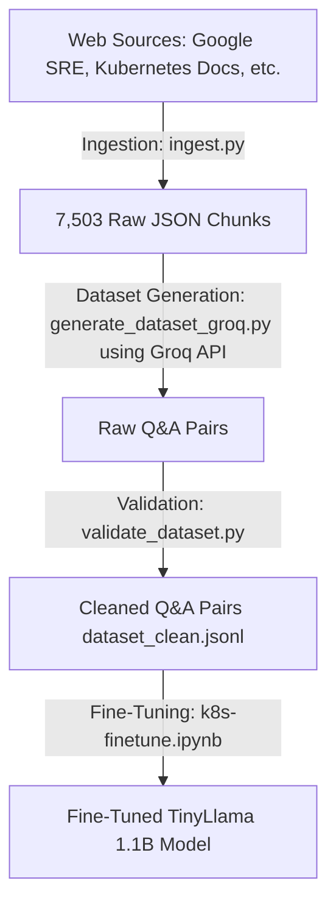

# Kubernetes Fine-Tuning Pipeline

This repository contains the pipeline for collecting Kubernetes and SRE documentation, generating question-answering (Q&A) datasets, validating the generated QA pairs, and fine-tuning a Small Language Model (SLM) on the processed dataset.

---

## Pipeline Overview



---

## 1. Data Ingestion & Curation Strategy

### Comparison: Instructor's Proposed Strategy vs. Implemented Strategy

The instructor proposed a manual chunking and curation strategy targeting official Kubernetes documentation. The **implemented strategy** scales much better, automates data cleaning, and covers a broader scope.

| Feature | Instructor's Proposal | Implemented Ingestion (This Repo) |
| :--- | :--- | :--- |
| **Scope** | Only official K8s Markdown docs | **5 authoritative sources**: Kubernetes Docs, Prometheus Runbooks, Kubernetes Failures, OpenSRE, and Google SRE |
| **Scale** | ~200 chunks, manually cleaned to 100–150 | **7,503 chunks** ingested automatically (see chunking strategy below) |
| **Curation** | Manual clustering and de-duplication | Programmatic validation and deduplication in [`validate_dataset.py`](file:///d:/rag-assistant/k8s-finetune/services/dataset/validate_dataset.py) |
| **Chunking** | Manual, "complete self-contained explanation" per chunk | Automated **heading-based section splitting** (see below) — achieves the same "complete, self-contained" principle the instructor specified, without manual effort |
| **Tagging** | Manual URL/version tracking & failure class tagging | Automated source/URL tracking via md5-hash filenames, plus **heuristic failure-class tagging** per chunk |

#### Why the Implemented Strategy is Better
1. **Broader SRE Knowledge**: By ingesting Prometheus Runbooks, SRE books, and failure stories alongside official docs, the SLM gains actual troubleshooting knowledge rather than just API definitions.
2. **Scalability**: Manual curation of 100 documents does not scale. Automated scraping and programmatically-validated Q&A pair extraction allows scaling to thousands of high-quality samples.
3. **Data Integrity**: Automated hashing prevents duplicate processing, and programmatic filtering removes bad formatting or hallucinated model text without human error or bias.

---

## 2. Chunking Strategy: Old vs. New

This is the most consequential change in the ingestion pipeline, and it's worth calling out on its own.

### The Old Strategy: Whole-Page Chunking

The original scraper (`k8s_docs.py`) treated **one entire documentation page as one chunk**, regardless of how long that page was:

```python
def parse_page(url: str) -> dict | None:
    ...
    text = main.get_text(separator="\n", strip=True)
    if len(text) < 200:
        return None
    return {
        "text": text,
        "metadata": {"source_url": url, "title": title, "source": "kubernetes_docs"}
    }
```

This produced **1,212 raw documents** across all 5 sources combined. It looked reasonable on the surface, but it silently broke downstream: the dataset generation step truncates each document's text to fit within model context/token limits (`text[:2500]`, later raised to `text[:6000]`). For a short concept page, the whole page fit easily. But for long pages — e.g. a full "Pod Lifecycle" or "Troubleshooting" reference page covering many distinct sub-topics — **only the first 2,500–6,000 characters were ever seen by the model.** Everything past that cutoff (often the majority of the page) was silently discarded before a single Q&A pair could be generated from it.

This directly violated the instructor's own chunking principle:

> "Do not chunk by character count. Each chunk should be a complete, self-contained explanation... This keeps SLMs from learning fragmented, incomplete knowledge."

Ironically, whole-page chunking + downstream truncation *is* character-count chunking — it just happens one step later in the pipeline instead of at ingestion time.

### The New Strategy: Heading-Based Section Chunking

`k8s_docs.py` now splits each page along its actual heading structure (`h1`/`h2`/`h3`) into **self-contained sections**, instead of yielding the whole page as one blob:

```python
def _split_into_sections(main, page_title: str) -> list[dict]:
    """
    Split a page's main content into self-contained sections based on
    heading structure (h2/h3), instead of returning the whole page as one
    blob. Each section keeps everything between one heading and the next
    heading of the same or higher level — a complete logical unit, not an
    arbitrary character-count slice.
    """
```

Key behaviors:
- **One section = one chunk.** A page like "Pod Lifecycle" with 5 distinct `h2` sections now yields 5 focused chunks instead of 1 oversized one.
- **Short sections merge forward** (`MIN_SECTION_CHARS = 300`) rather than becoming tiny, low-value chunks or getting dropped.
- **Anchor-aware source URLs**: each chunk's `source_url` points to `page#section-anchor` when the heading has an `id`, so every chunk is traceable down to the exact section, not just the page.
- **Heuristic failure-class tagging**: each chunk is scanned for keywords tied to the 7 target failure classes (OOMKilled, CrashLoopBackOff, RBAC, etc.) and tagged accordingly — this preserves the instructor's "tag each chunk with failure classes" requirement, just automated instead of manual.

### The Difference, in Numbers

| | Old (whole-page) | New (heading-based sections) |
| :--- | :--- | :--- |
| **`k8s_docs` chunks** | part of 1,212 total (all sources) | **7,279** |
| **Total raw documents (all 5 sources)** | 1,212 | **7,503** |
| **Content actually reaching the LLM** | First 2,500–6,000 chars per page only | Full page content, split across right-sized chunks |

The `k8s_docs` source alone grew from a fraction of the original 1,212-document pool to **7,279 chunks on its own** — roughly a 6x increase in the total corpus size, driven almost entirely by this one fix. This isn't inflation for its own sake: it's the same underlying Kubernetes documentation, just no longer being silently cut off before the model ever sees it.

### Why This Is Absolutely Necessary

1. **No more silent data loss.** Under the old strategy, long pages contributed a fraction of their actual content to the training set — the rest simply never existed as far as the generation step was concerned. The new strategy guarantees every section of every page is eligible for Q&A generation.
2. **Matches the "complete, self-contained explanation" principle exactly.** Instead of an arbitrary character cutoff mid-topic, each chunk now corresponds to one coherent concept (e.g. "Restart Policy," "Liveness Probes," "RBAC Role Binding") — precisely what the instructor's proposal called for, just achieved automatically at web-scale instead of manually across ~150 hand-picked docs.
3. **Better-grounded, less speculative Q&A.** A focused, complete section gives the generation model a clean, bounded scope to answer from — reducing the risk of hedging or invented answers that comes from either (a) a truncated chunk missing context, or (b) an oversized chunk forcing the model to generalize across unrelated sub-topics.
4. **Enables real failure-class targeting.** With section-level granularity and heuristic tagging, it becomes possible to specifically target generation toward the instructor's 7 named failure classes in later iterations — something that was effectively impossible when a "chunk" was an entire multi-topic page.

---

## 3. Dataset Generation Strategy

### Correction: This Pipeline Uses Groq, Not Ollama

An earlier version of this document described generation as "Ollama / Local LLM style." That's no longer accurate — the pipeline was migrated from a local Ollama model (`phi3:mini`) to **Groq's hosted API**, for two reasons: response quality/length, and eliminating local hardware/runtime constraints entirely.

* **Target Script**: [`generate_dataset_groq.py`](file:///d:/rag-assistant/k8s-finetune/services/dataset/generate_dataset_groq.py)
* **Endpoint**: Groq's OpenAI-compatible `chat/completions` API (`https://api.groq.com/openai/v1/chat/completions`)

### Multi-Model Rotation (Quota Management)

Groq's free tier enforces per-model daily token caps (TPD) as low as 100K–200K for some models. Rather than being blocked by a single model's daily limit, generation rotates across several Groq-hosted models with independent quota buckets:

| Model | TPD | Notes |
| :--- | :--- | :--- |
| `llama-3.1-8b-instant` | 500K | Best daily headroom |
| `meta-llama/llama-4-scout-17b-16e-instruct` | 500K | Best TPM + TPD combination |
| `qwen/qwen3-32b` | 500K | Larger model, good quality |
| `llama-3.3-70b-versatile` | 100K | Strong quality, tighter daily budget |
| `openai/gpt-oss-20b` | 200K | Groq's default/fallback recommendation |

The script reads Groq's live rate-limit response headers (`x-ratelimit-remaining-tokens`, `x-ratelimit-reset-tokens`, etc.) to pace requests proactively, and distinguishes a short per-minute wait from a genuine daily-quota exhaustion (raising a `DailyQuotaExhausted` signal that stops the run cleanly rather than retrying pointlessly for hours). All progress is written incrementally, so an interrupted run resumes automatically from where it left off on the next invocation, skipping already-completed titles.

### Structured Prompting

A strict system prompt ensures valid JSON output with no conversational wrapper text:
```python
SYSTEM_PROMPT = (
    "You are a Kubernetes expert creating a training dataset. "
    "You always respond with valid JSON only — no preamble, no markdown "
    "code fences, no commentary."
)
```

### Variable Pair Count (Not a Fixed 5)

The original generation prompt forced **exactly 5** Q&A pairs per document, regardless of how much substantive content that document actually contained. That made sense under whole-page chunking, where every chunk was large. It stopped making sense once chunking moved to focused, section-level chunks (Section 2 above): forcing 5 pairs out of a short, narrow section risks padding with trivial questions or the model stretching beyond what the text supports — exactly the kind of speculative, hedged answer the validation step (Section 4) is built to catch.

The prompt now asks for a natural range instead:
```python
GENERATION_PROMPT = """Read the following Kubernetes documentation and generate high-quality question-answer pairs.

Rules:
- Generate as many pairs as the text genuinely supports — typically 2 to 4 for a focused section.
  Do NOT pad with trivial, repetitive, or overly generic questions just to hit a number.
- If the text is too thin or narrow to support even 2 distinct, meaningful questions, generate just 1 — or return an empty "pairs" list rather than inventing content.
...
"""
```

A chunk that correctly returns an empty `"pairs": []` (because the section genuinely didn't support a good question) is tracked separately from an actual error:
```python
if pairs is None:
    failed += 1          # real error: network, bad JSON, HTTP failure, etc.
elif len(pairs) == 0:
    skipped_thin += 1     # model correctly declined — not a failure
else:
    ...                   # write pairs to dataset.jsonl
```

### Context Window

```python
def generate_pairs(doc: dict) -> list[dict] | None:
    text = doc["text"][:6000]
    prompt = GENERATION_PROMPT.format(
        title=doc["title"],
        source=doc["source"],
        text=text
    )
```
This cap is now a safety net for outlier-long merged sections, rather than the routine, content-losing truncation it was under whole-page chunking.

---

## 4. Dataset Validation & Cleaning

To ensure the high quality of the instruction-tuning pairs, raw output pairs are passed through a strict validator to remove duplicates, bad formatting, and low-quality model behavior.

* **Target Script**: [`validate_dataset.py`](file:///d:/rag-assistant/k8s-finetune/services/dataset/validate_dataset.py)
* **Output**: `dataset_clean.jsonl` containing high-quality pairs.

### Key Code Logic

1. **Rejection Rules (`is_valid`)**: Checks each Q&A pair against criteria:
   - **Hedging Check**: Filters phrases indicating guessing rather than grounded extraction (e.g. *"not explicitly stated"*, *"could imply"*, *"it is unclear"*).
   - **Self-Reference Check**: Rejects boilerplate AI self-mentions (e.g. *"as an AI language model"*).
   - **Admitted Ignorance Check**: Rejects fallback responses (e.g. *"I don't know"*, *"unable to determine"*).
   - **Truncation Check (`looks_truncated`)**: Flags responses that end abruptly — missing terminal punctuation or ending on a dangling conjunction/article — a sign the model's output was cut off mid-sentence by a token limit.
   - **Length Constraints**: Minimum 10 chars for instructions, 20 chars for responses.

2. **Deduplication**: Dedups on `(instruction, response)` pairs so identical Q&A generated more than once (e.g. across a resumed or re-run session) isn't repeated in the training set:
   ```python
   key = (
       str(pair.get("instruction", "")).strip().lower(),
       str(pair.get("response", "")).strip().lower(),
   )
   if key in seen:
       duplicates += 1
       continue
   seen.add(key)
   valid.append(pair)
   ```

3. **Resilient parsing**: malformed JSON lines are logged with their line number and skipped, rather than silently swallowed or crashing the whole validation run.

---

## 5. Model Fine-Tuning

The clean dataset is used to fine-tune a TinyLlama (1.1B) model using Parameter-Efficient Fine-Tuning (PEFT) and QLoRA.

* **Target Notebook**: [k8s-finetune.ipynb](file:///d:/rag-assistant/k8s-finetune/notebooks/k8s-finetune.ipynb)
* **Dataset Split**: A **95% Train / 5% Test** split is implemented (`train_size=2489`, `test_size=131`) using a fixed seed (`42`). This split ratio is chosen over traditional 80/20 splits to maximize the available training examples for learning specific Kubernetes SRE diagnostics.
* **Hyperparameters**: 7 Epochs, Batch Size of 4, Gradient Accumulation Steps of 4, Learning Rate of `2e-4`.

### Important Code Segments

1. **4-Bit Quantization Setup**:
   Loads the model using a 4-bit NormalFloat (`nf4`) quantization format to drastically reduce GPU memory footprint on the accelerator.
   ```python
   bnb_config = BitsAndBytesConfig(
       load_in_4bit=True,
       bnb_4bit_quant_type="nf4",
       bnb_4bit_compute_dtype=torch.float16,
       bnb_4bit_use_double_quant=True,
   )

   model = AutoModelForCausalLM.from_pretrained(
       MODEL_NAME,
       quantization_config=bnb_config,
       device_map="cuda:0",
   )
   model = prepare_model_for_kbit_training(model)
   ```

2. **PEFT/LoRA Configuration**:
   Sets up low-rank adapters targetting the attention projection matrices (`q_proj`, `v_proj`, `k_proj`, `o_proj`) with rank `r=16`.
   ```python
   lora_config = LoraConfig(
       r=16,
       lora_alpha=32,
       target_modules=["q_proj", "v_proj", "k_proj", "o_proj"],
       lora_dropout=0.05,
       bias="none",
       task_type="CAUSAL_LM",
   )
   model = get_peft_model(model, lora_config)
   ```

3. **Supervised Fine-Tuning Configuration (SFTConfig)**:
   Specifies the training hyperparameters such as 7 epochs, learning rate of `2e-4`, BF16 mixed-precision, and gradient checkpointing.
   ```python
   training_args = SFTConfig(
       output_dir="/kaggle/working/k8s-tinyllama",
       num_train_epochs=7,
       per_device_train_batch_size=4,
       per_device_eval_batch_size=4,
       gradient_accumulation_steps=4,
       warmup_steps=100,
       learning_rate=2e-4,
       bf16=True,
       logging_steps=50,
       eval_strategy="steps",
       eval_steps=200,
       save_steps=200,
       save_total_limit=2,
       load_best_model_at_end=True,
       report_to="none",
       dataset_text_field="text",
       max_length=512,
       gradient_checkpointing=True,
   )

   trainer = SFTTrainer(
       model=model,
       args=training_args,
       train_dataset=dataset["train"],
       eval_dataset=dataset["test"],
   )
   trainer.train()
   ```

4. **Saving Model & Tokenizer**:
   Saves the final trained PEFT weights along with the tokenizer files.
   ```python
   trainer.model.save_pretrained(OUTPUT_PATH)
   tokenizer.save_pretrained(OUTPUT_PATH)
   ```
